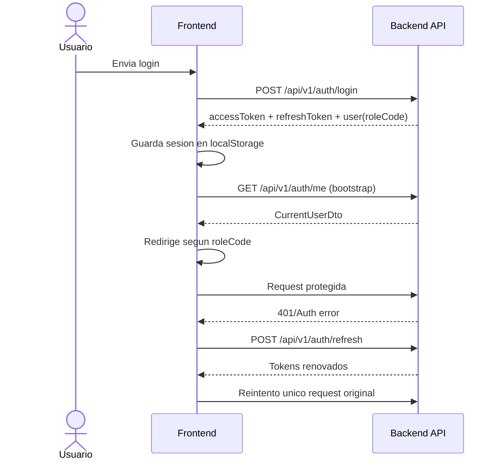
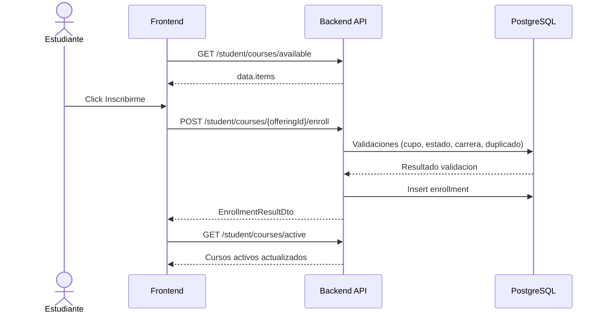
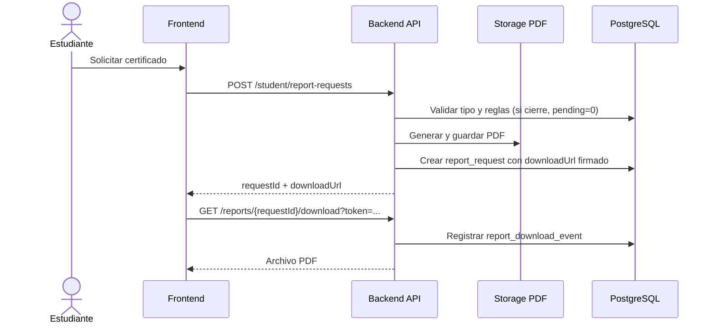
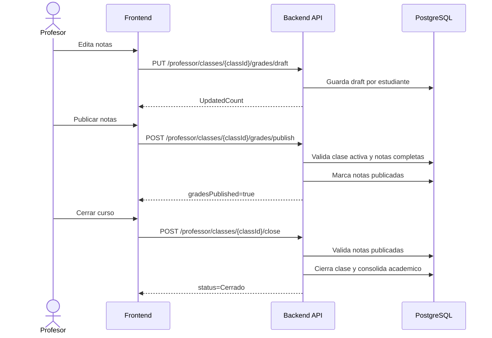
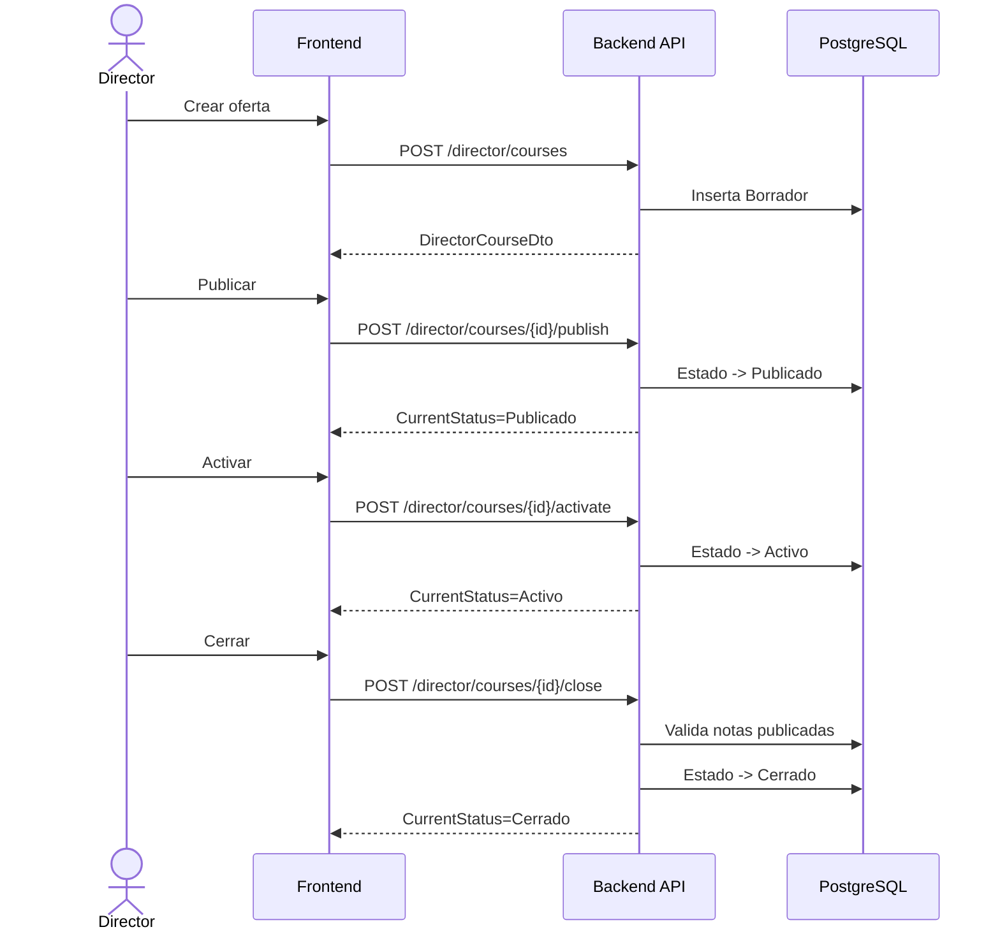
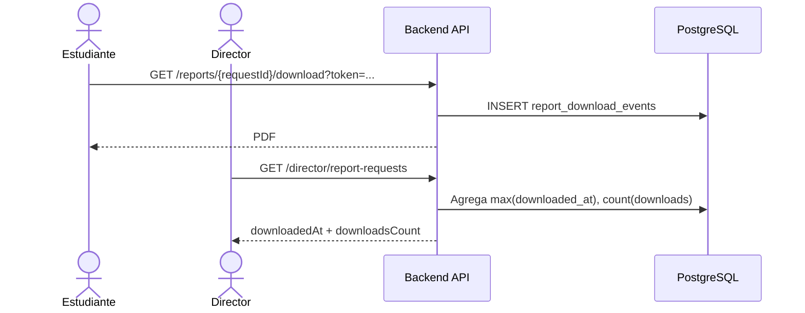

# Casos de uso y flujos operativos

## 1. Convenciones

## 1.1 Formato de cada caso de uso

Cada caso usa este formato:
1. Actor.
2. Precondiciones.
3. Disparador.
4. Flujo principal (numerado).
5. Flujos alternos y errores funcionales.
6. Postcondicion.
7. Endpoints implicados.
8. Estado.

Estados usados en este documento:
- Implementado: flujo funcional operativo extremo a extremo.
- Parcial: existe parte funcional, pero falta UX o paso complementario.
- Pendiente: no implementado.

## 1.2 Convenciones tecnicas

- API base: `/api/v1`.
- Respuestas JSON: envelope `data/meta/errors`.
- Excepcion: descarga PDF (`/api/v1/reports/{requestId}/download`) responde archivo binario.

## 2. Casos de uso - Estudiante

## UC-EST-01 Iniciar sesion

Actor:
- Estudiante.

Precondiciones:
- Usuario existe y esta activo.

Disparador:
- Envio de formulario en `/login`.

Flujo principal:
1. Usuario ingresa `usernameOrEmail` y `password`.
2. Frontend llama `POST /api/v1/auth/login`.
3. Backend valida credenciales y retorna tokens + `roleCode`.
4. Frontend guarda sesion en `localStorage`.
5. Frontend redirige a `/dashboard/estudiante`.

Flujos alternos y errores:
- `AUTH_INVALID_CREDENTIALS`: credenciales invalidas.
- `AUTH_USER_DISABLED`: usuario deshabilitado.

Postcondicion:
- Sesion activa persistida en cliente.

Endpoints implicados:
- `POST /api/v1/auth/login`
- `GET /api/v1/auth/me` (bootstrap posterior)
- `POST /api/v1/auth/refresh` (si aplica)

Estado:
- Implementado.

## UC-EST-02 Inscribirse a carrera

Actor:
- Estudiante sin carrera activa.

Precondiciones:
- Login valido.
- Estudiante sin `careerId` activo.

Disparador:
- Boton `Inscribirme` en dashboard de estudiante sin carrera.

Flujo principal:
1. Frontend consulta carreras activas.
2. Usuario selecciona carrera.
3. Frontend ejecuta `POST /api/v1/student/career-enrollment`.
4. Backend asigna carrera y pensum activo.
5. Frontend recarga datos del rol y muestra dashboard normal.

Flujos alternos y errores:
- `STUDENT_ALREADY_HAS_CAREER`.
- `CAREER_NOT_FOUND`.
- `CAREER_WITHOUT_ACTIVE_CURRICULUM`.

Postcondicion:
- Estudiante queda con carrera/pensum activo.

Endpoints implicados:
- `GET /api/v1/catalog/careers`
- `POST /api/v1/student/career-enrollment`

Estado:
- Implementado.

## UC-EST-03 Consultar progreso de pensum

Actor:
- Estudiante.

Precondiciones:
- Carrera y pensum asignados.

Disparador:
- Apertura de dashboard o `Mis cursos`.

Flujo principal:
1. Frontend llama `GET /api/v1/student/curriculum/progress`.
2. Backend calcula `approved/pending/total` considerando equivalencias activas.
3. Frontend muestra pendientes y contadores.

Flujos alternos y errores:
- `CURRICULUM_VERSION_NOT_ASSIGNED`.
- `STUDENT_WITHOUT_CAREER`.

Postcondicion:
- Progreso visible y usable para decisiones de inscripcion/cierre.

Endpoints implicados:
- `GET /api/v1/student/curriculum/progress`
- `GET /api/v1/student/dashboard`

Estado:
- Implementado.

## UC-EST-04 Inscribirse a oferta de curso

Actor:
- Estudiante.

Precondiciones:
- Carrera activa.
- Oferta disponible para su carrera.

Disparador:
- Boton `Inscribirme` en `Mis cursos`.

Flujo principal:
1. Frontend lista ofertas disponibles.
2. Usuario selecciona oferta.
3. Frontend llama `POST /api/v1/student/courses/{offeringId}/enroll`.
4. Backend valida reglas de negocio.
5. Backend crea inscripcion.
6. Frontend recarga cursos activos/disponibles.

Flujos alternos y errores:
- `ENROLLMENT_ALREADY_EXISTS`.
- `COURSE_OFFERING_CAPACITY_EXHAUSTED`.
- `COURSE_OFFERING_NOT_PUBLISHED`.
- `CAREER_MISMATCH`.

Postcondicion:
- Estudiante inscrito en oferta activa.

Endpoints implicados:
- `GET /api/v1/student/courses/available`
- `POST /api/v1/student/courses/{offeringId}/enroll`
- `GET /api/v1/student/courses/active`

Estado:
- Implementado.

## UC-EST-05 Generar certificacion de cursos

Actor:
- Estudiante.

Precondiciones:
- Login valido.

Disparador:
- Boton `Generar certificado` en dashboard estudiante.

Flujo principal:
1. Frontend llama `POST /api/v1/student/report-requests` con `requestType=Certificacion de cursos`.
2. Backend arma dataset historico y genera PDF.
3. Backend persiste solicitud con `downloadUrl` firmado.
4. Frontend abre `downloadUrl` en nueva pestana.
5. Endpoint de descarga registra evento de auditoria.

Flujos alternos y errores:
- `REPORT_TYPE_INVALID`.
- `REPORT_DOWNLOAD_TOKEN_INVALID`.
- `REPORT_DOWNLOAD_TOKEN_EXPIRED`.

Postcondicion:
- PDF descargado y evento de descarga auditado.

Endpoints implicados:
- `POST /api/v1/student/report-requests`
- `GET /api/v1/reports/{requestId}/download?token=...`
- `GET /api/v1/director/report-requests` (lectura auditoria)

Estado:
- Implementado.

## UC-EST-06 Generar cierre de pensum

Actor:
- Estudiante.

Precondiciones:
- Pensum activo asignado.
- Todos los cursos requeridos resueltos (`pending = 0`).

Disparador:
- Boton `Cierre de pensum` en dashboard estudiante.

Flujo principal:
1. Frontend llama `POST /api/v1/student/report-requests` con `requestType=Cierre de pensum`.
2. Backend valida elegibilidad contra progreso real.
3. Si cumple, genera PDF de cierre y retorna `downloadUrl`.
4. Frontend abre URL y descarga archivo.

Flujos alternos y errores:
- `CURRICULUM_NOT_COMPLETED_FOR_CLOSURE` (422).
- `REPORT_DOWNLOAD_TOKEN_INVALID`.
- `REPORT_DOWNLOAD_TOKEN_EXPIRED`.

Postcondicion:
- PDF de cierre descargado cuando aplica.

Endpoints implicados:
- `GET /api/v1/student/curriculum/progress`
- `POST /api/v1/student/report-requests`
- `GET /api/v1/reports/{requestId}/download?token=...`

Estado:
- Implementado.

## 3. Casos de uso - Profesor

## UC-PRO-01 Consultar clases asignadas

Actor:
- Profesor.

Precondiciones:
- Login de profesor.

Disparador:
- Apertura de dashboard/mis clases.

Flujo principal:
1. Frontend solicita dashboard de profesor.
2. Frontend solicita clases paginadas.
3. Frontend carga alumnos por clase para metricas de avance.
4. Frontend renderiza lista y estado de clase.

Flujos alternos y errores:
- `FORBIDDEN_ROLE`.
- `PROFESSOR_PROFILE_NOT_FOUND`.
- Errores no-auth de clase individual se degradan sin romper toda la carga.

Postcondicion:
- Profesor visualiza su carga academica.

Endpoints implicados:
- `GET /api/v1/professor/dashboard`
- `GET /api/v1/professor/classes`
- `GET /api/v1/professor/classes/{classId}/students`

Estado:
- Implementado.

## UC-PRO-02 Registrar notas en borrador

Actor:
- Profesor.

Precondiciones:
- Clase accesible para el profesor.
- Clase no cerrada.

Disparador:
- Edicion en modal `Asignar notas`.

Flujo principal:
1. Profesor ingresa notas por estudiante.
2. Frontend arma payload `grades[]`.
3. Frontend ejecuta `PUT /grades/draft`.
4. Backend valida rango de nota y permisos.
5. Frontend actualiza vista.

Flujos alternos y errores:
- `GRADE_OUT_OF_RANGE`.
- `FORBIDDEN_CLASS_ACCESS`.
- `GRADE_EDIT_LOCKED`.

Postcondicion:
- Notas draft persistidas para la clase.

Endpoints implicados:
- `PUT /api/v1/professor/classes/{classId}/grades/draft`

Estado:
- Implementado.

## UC-PRO-03 Publicar notas

Actor:
- Profesor.

Precondiciones:
- Clase activa.
- Todas las notas requeridas cargadas.

Disparador:
- Boton `Publicar notas`.

Flujo principal:
1. Frontend guarda draft actual.
2. Frontend llama `POST /grades/publish`.
3. Backend valida estado y completitud.
4. Backend marca notas publicadas.
5. Frontend refresca lista de clases.

Flujos alternos y errores:
- `CLASS_NOT_ACTIVE_FOR_GRADING`.
- `GRADES_INCOMPLETE`.
- `GRADES_ALREADY_PUBLISHED`.

Postcondicion:
- Clase con notas publicadas.

Endpoints implicados:
- `PUT /api/v1/professor/classes/{classId}/grades/draft`
- `POST /api/v1/professor/classes/{classId}/grades/publish`

Estado:
- Implementado.

## UC-PRO-04 Cerrar curso

Actor:
- Profesor.

Precondiciones:
- Clase con notas publicadas.

Disparador:
- Boton `Cerrar curso`.

Flujo principal:
1. Frontend llama `POST /classes/{classId}/close`.
2. Backend valida reglas de cierre.
3. Backend cierra clase y consolida registros academicos segun reglas.
4. Frontend recarga estado.

Flujos alternos y errores:
- `COURSE_CANNOT_CLOSE_UNTIL_GRADES_PUBLISHED`.
- `CLASS_ALREADY_CLOSED`.

Postcondicion:
- Clase cerrada.

Endpoints implicados:
- `POST /api/v1/professor/classes/{classId}/close`

Estado:
- Implementado.

## UC-PRO-05 Consultar resumen de estudiantes

Actor:
- Profesor.

Precondiciones:
- Login de profesor.

Disparador:
- Apertura de pantalla `Estudiantes`.

Flujo principal:
1. Frontend consulta resumen de estudiantes paginado.
2. Backend calcula promedio de aprobadas por estudiante.
3. Frontend muestra tabla.

Flujos alternos y errores:
- `FORBIDDEN_ROLE`.
- `PROFESSOR_PROFILE_NOT_FOUND`.

Postcondicion:
- Resumen academico visible por alumno.

Endpoints implicados:
- `GET /api/v1/professor/students`

Estado:
- Implementado.

## 4. Casos de uso - Director

## UC-DIR-01 Consultar dashboard operativo

Actor:
- Director.

Precondiciones:
- Login de director.

Disparador:
- Apertura de dashboard director.

Flujo principal:
1. Frontend solicita dashboard.
2. Backend retorna KPIs, capacidad, clases y disponibilidad.
3. Frontend muestra tarjetas, tablas y barras.

Flujos alternos y errores:
- `FORBIDDEN_ROLE`.
- `DIRECTOR_PROFILE_NOT_FOUND`.

Postcondicion:
- Director visualiza estado operativo.

Endpoints implicados:
- `GET /api/v1/director/dashboard`
- `GET /api/v1/director/teacher-availability`

Estado:
- Implementado.

## UC-DIR-02 Crear oferta en borrador

Actor:
- Director.

Precondiciones:
- Carrera y curso base validos.

Disparador:
- Boton `Nuevo curso`.

Flujo principal:
1. Frontend carga catalogos de carreras y cursos base.
2. Director llena formulario.
3. Frontend llama `POST /api/v1/director/courses`.
4. Backend crea oferta en estado borrador.
5. Frontend refresca lista de cursos.

Flujos alternos y errores:
- `INVALID_CAPACITY`.
- `COURSE_OFFERING_CODE_ALREADY_EXISTS`.
- `CAREER_NOT_FOUND`.
- `COURSE_NOT_FOUND`.

Postcondicion:
- Oferta borrador creada.

Endpoints implicados:
- `GET /api/v1/catalog/careers`
- `GET /api/v1/catalog/base-courses`
- `POST /api/v1/director/courses`

Estado:
- Implementado.

## UC-DIR-03 Publicar oferta

Actor:
- Director.

Precondiciones:
- Oferta en estado borrador.

Disparador:
- Boton `Publicar`.

Flujo principal:
1. Frontend ejecuta `POST /courses/{offeringId}/publish`.
2. Backend cambia estado a publicado.
3. Frontend refresca tabla.

Flujos alternos y errores:
- `COURSE_OFFERING_ALREADY_PUBLISHED`.
- `COURSE_OFFERING_ALREADY_ACTIVE`.
- `COURSE_OFFERING_ALREADY_CLOSED`.

Postcondicion:
- Oferta publicada.

Endpoints implicados:
- `POST /api/v1/director/courses/{offeringId}/publish`

Estado:
- Implementado.

## UC-DIR-04 Activar oferta

Actor:
- Director.

Precondiciones:
- Oferta publicada.

Disparador:
- Boton `Activar`.

Flujo principal:
1. Frontend ejecuta `POST /courses/{offeringId}/activate`.
2. Backend cambia estado a activo.
3. Frontend refresca tabla.

Flujos alternos y errores:
- `COURSE_OFFERING_ALREADY_ACTIVE`.
- `COURSE_OFFERING_ALREADY_CLOSED`.

Postcondicion:
- Oferta activa.

Endpoints implicados:
- `POST /api/v1/director/courses/{offeringId}/activate`

Estado:
- Implementado.

## UC-DIR-05 Asignar profesor a oferta

Actor:
- Director.

Precondiciones:
- Oferta existente.
- Profesor existente.

Disparador:
- Boton `Asignar profesor` y confirmacion en modal.

Flujo principal:
1. Director abre modal.
2. Selecciona profesor.
3. Frontend llama `POST /assign-professor`.
4. Backend persiste asignacion.
5. Frontend refresca cursos y dashboard.

Flujos alternos y errores:
- `PROFESSOR_PROFILE_NOT_FOUND`.
- `COURSE_OFFERING_NOT_FOUND`.

Postcondicion:
- Oferta queda asignada a profesor.

Endpoints implicados:
- `POST /api/v1/director/courses/{offeringId}/assign-professor`

Estado:
- Implementado.

## UC-DIR-06 Cerrar oferta

Actor:
- Director.

Precondiciones:
- Oferta activa.
- Notas publicadas.

Disparador:
- Boton `Cerrar`.

Flujo principal:
1. Frontend llama `POST /courses/{offeringId}/close`.
2. Backend valida reglas.
3. Backend cierra oferta.
4. Frontend refresca estado.

Flujos alternos y errores:
- `COURSE_CANNOT_CLOSE_UNTIL_GRADES_PUBLISHED`.
- `COURSE_OFFERING_ALREADY_CLOSED`.

Postcondicion:
- Oferta cerrada.

Endpoints implicados:
- `POST /api/v1/director/courses/{offeringId}/close`

Estado:
- Implementado.

## UC-DIR-07 Consultar reportes y descargas

Actor:
- Director.

Precondiciones:
- Existen solicitudes de reporte.

Disparador:
- Apertura de pantalla `Reportes`.

Flujo principal:
1. Frontend consulta solicitudes paginadas.
2. Backend agrega `downloadsCount` y `downloadedAt`.
3. Director visualiza historial.

Flujos alternos y errores:
- `FORBIDDEN_ROLE`.

Postcondicion:
- Auditoria funcional visible.

Endpoints implicados:
- `GET /api/v1/director/report-requests`

Estado:
- Implementado.

## UC-DIR-08 Consultar disponibilidad docente

Actor:
- Director.

Precondiciones:
- Profesores registrados.

Disparador:
- Dashboard director.

Flujo principal:
1. Frontend consulta disponibilidad.
2. Backend retorna lista de estado por profesor.
3. UI mapea estado a etiquetas visuales.

Flujos alternos y errores:
- `DIRECTOR_PROFILE_NOT_FOUND`.

Postcondicion:
- Disponibilidad visible para decision de asignacion.

Endpoints implicados:
- `GET /api/v1/director/teacher-availability`

Estado:
- Implementado.

## 5. Diagramas Mermaid

## 5.1 Flujo de autenticacion y bootstrap de sesion

## 5.2 Flujo estudiante de inscripcion de curso

## 5.3 Flujo estudiante de generacion y descarga de certificado

## 5.4 Flujo profesor draft -> publish -> close

## 5.5 Flujo director borrador -> publicado -> activo -> cierre

## 5.6 Flujo de auditoria de descargas (estudiante/director)

## 6. Matriz de trazabilidad (caso de uso -> ruta -> endpoint -> estado)

| Caso | Ruta frontend | Accion UI | Endpoint backend | Estado |
|---|---|---|---|---|
| UC-EST-01 | `/login` | Iniciar sesion | `POST /api/v1/auth/login` | Implementado |
| UC-EST-02 | `/dashboard/estudiante` | Inscripcion de carrera | `POST /api/v1/student/career-enrollment` | Implementado |
| UC-EST-03 | `/dashboard/estudiante`, `/dashboard/estudiante/mis-cursos` | Ver progreso pensum | `GET /api/v1/student/curriculum/progress` | Implementado |
| UC-EST-04 | `/dashboard/estudiante/mis-cursos` | Inscribirse a oferta | `POST /api/v1/student/courses/{offeringId}/enroll` | Implementado |
| UC-EST-05 | `/dashboard/estudiante` | Generar certificacion de cursos | `POST /api/v1/student/report-requests` | Implementado |
| UC-EST-05 | N/A (descarga) | Descargar PDF | `GET /api/v1/reports/{requestId}/download` | Implementado |
| UC-EST-06 | `/dashboard/estudiante` | Generar cierre de pensum | `POST /api/v1/student/report-requests` | Implementado |
| UC-PRO-01 | `/dashboard/profesor`, `/dashboard/profesor/mis-clases` | Ver clases | `GET /api/v1/professor/classes` | Implementado |
| UC-PRO-01 | `/dashboard/profesor/mis-clases` | Ver estudiantes por clase | `GET /api/v1/professor/classes/{classId}/students` | Implementado |
| UC-PRO-02 | `/dashboard/profesor`, `/dashboard/profesor/mis-clases` | Guardar draft | `PUT /api/v1/professor/classes/{classId}/grades/draft` | Implementado |
| UC-PRO-03 | `/dashboard/profesor`, `/dashboard/profesor/mis-clases` | Publicar notas | `POST /api/v1/professor/classes/{classId}/grades/publish` | Implementado |
| UC-PRO-04 | `/dashboard/profesor`, `/dashboard/profesor/mis-clases` | Cerrar curso | `POST /api/v1/professor/classes/{classId}/close` | Implementado |
| UC-PRO-05 | `/dashboard/profesor/estudiantes` | Ver resumen estudiantes | `GET /api/v1/professor/students` | Implementado |
| UC-DIR-01 | `/dashboard/director` | Ver dashboard | `GET /api/v1/director/dashboard` | Implementado |
| UC-DIR-02 | `/dashboard/director`, `/dashboard/director/cursos` | Crear oferta borrador | `POST /api/v1/director/courses` | Implementado |
| UC-DIR-03 | `/dashboard/director/cursos` | Publicar oferta | `POST /api/v1/director/courses/{offeringId}/publish` | Implementado |
| UC-DIR-04 | `/dashboard/director/cursos` | Activar oferta | `POST /api/v1/director/courses/{offeringId}/activate` | Implementado |
| UC-DIR-05 | `/dashboard/director`, `/dashboard/director/cursos` | Asignar profesor | `POST /api/v1/director/courses/{offeringId}/assign-professor` | Implementado |
| UC-DIR-06 | `/dashboard/director/cursos` | Cerrar oferta | `POST /api/v1/director/courses/{offeringId}/close` | Implementado |
| UC-DIR-07 | `/dashboard/director/reportes` | Ver historial de reportes | `GET /api/v1/director/report-requests` | Implementado |
| UC-DIR-08 | `/dashboard/director` | Ver disponibilidad docente | `GET /api/v1/director/teacher-availability` | Implementado |

## 7. Cobertura adicional de rutas y acciones criticas

Rutas sin caso de uso principal dedicado pero cubiertas por operacion:
- `/dashboard/estudiante/perfil`: consulta de perfil.
- `/dashboard/estudiante/registro-academico`: consulta historial academico.
- `/dashboard/director/profesores`: consulta directorio de profesores.
- `/dashboard/director/estudiantes`: consulta directorio de estudiantes.

Endpoints backend con capacidad implementada y sin flujo UI principal completo:
- `GET/POST /api/v1/director/curriculum-versions`
- `POST /api/v1/director/students/{studentId}/curriculum-assignment`
- `GET/POST /api/v1/director/course-equivalences`
